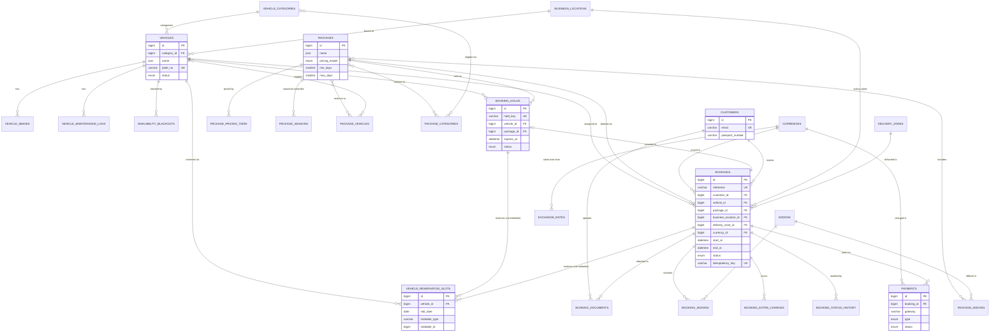

# ER Diagram

Scope note: this diagram covers the **Fleet → Package → Pricing → Availability → Booking → Payment → Customer** core — the part of the schema with real relational complexity and the double-booking-critical tables. CMS, SEO, Admin/Auth, and Report tables are simple (mostly polymorphic-to-anything or standalone lookup tables) and are described in prose in [03-database-schema.md](03-database-schema.md) rather than drawn, to keep this diagram legible.

### Reading the diagram

- `VEHICLE_RESERVATION_SLOTS.holdable_type/holdable_id` is a polymorphic pointer to either `BOOKING_HOLDS` or `BOOKINGS` (Laravel `morphTo`) — drawn here as two relationships out of the slots table rather than a true polymorphic notation, since Mermaid `erDiagram` has no native polymorphic-FK syntax. The `UNIQUE (vehicle_id, slot_date)` constraint on this table (not expressible in Mermaid's ER syntax either) is the actual double-booking guarantee — see [03-database-schema.md](03-database-schema.md).
- `BOOKING_HOLDS |o--|| BOOKINGS` ("converts to") is not a foreign key — it's the application-level relationship where `BookingService::confirmHold()` creates a `Booking` reusing the hold's `hold_key` as the booking's `idempotency_key`, then marks the hold `converted`. Modeling it as an FK would force every hold to eventually have a booking, which isn't true (holds also expire or get released).
